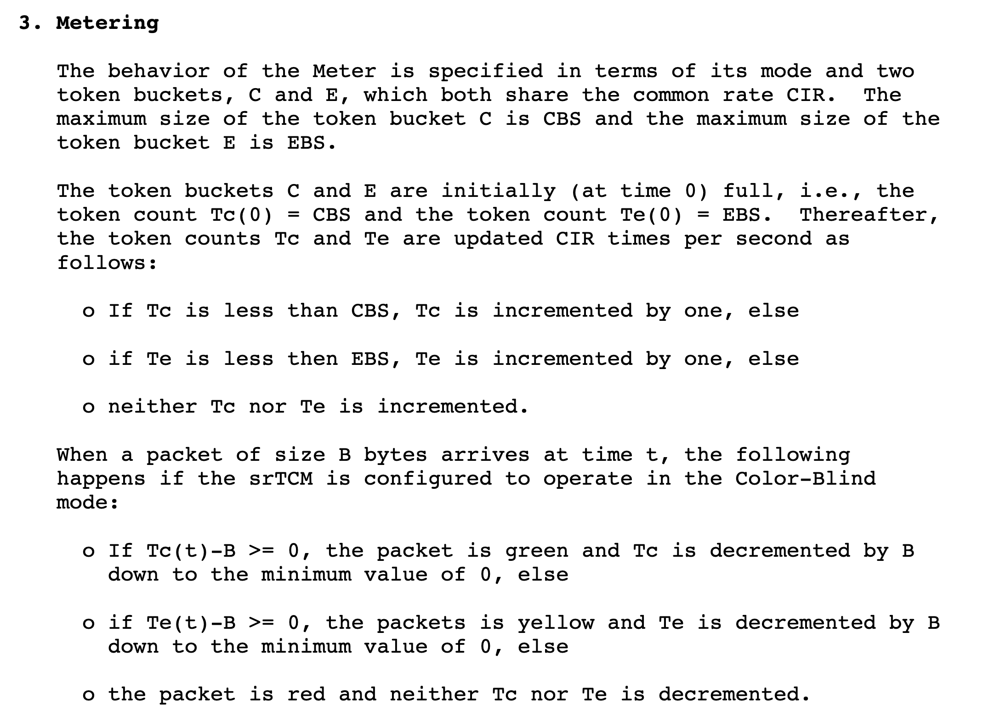
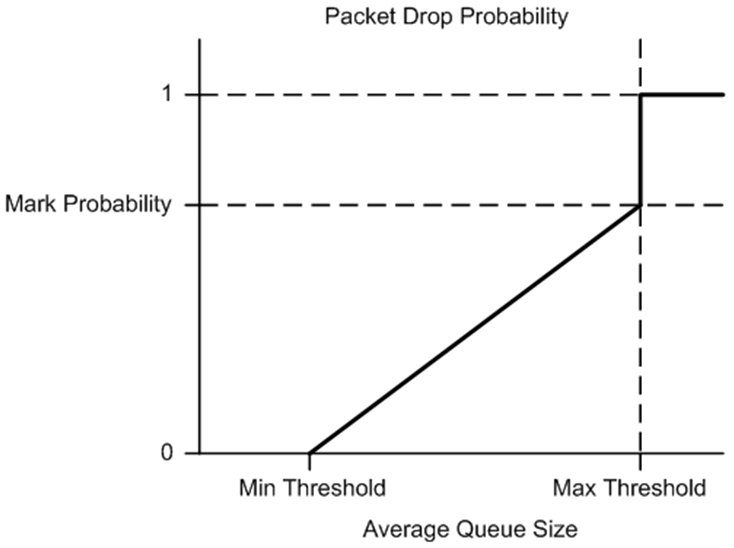

# QoS
## QoS introduction
QoS（Quality of Service，服务质量）指一个网络能够利用各种基础技术，为**指定的网络通信**提供更好的服务能力，是网络的一种安全机制， 是用来解决网络延迟和阻塞等问题的一种技术。

**当网络发生拥塞的时候，所有的数据流都有可能被丢弃；为满足用户对不同应用不同服务质量的要求，就需要网络能根据用户的要求分配和调度资源，对不同的数据流提供不同的服务质量**：对实时性强且重要的数据报文优先处理；对于实时性不强的普通数据报文，提供较低的处理优先级，网络拥塞时甚至丢弃。QoS应运而生。支持QoS功能的设备，能够提供传输品质服务；针对某种类别的数据流，可以为它赋予某个级别的**传输优先级，来标识它的相对重要性**，并使用设备所提供的各种**优先级转发策略、拥塞避免**等机制为这些数据流提供特殊的传输服务。配置了QoS的网络环境，增加了网络性能的可预知性，并能够有效地分配网络带宽，更加合理地利用网络资源。

阅读dpdk文档中QoS框架部分的内容可知，dpdk提供的QoS支持主要有Packet metering, Congestion management(avoidance)和Hierarchical scheduler，一个具有QoS支持的复杂包处理流水线如下图所示。

 
*Fig.1 具有QoS支持的复杂包处理流水线*

在这个流水线中实现QoS的主要模块是：Policer、Dropper和Scheduler，分别实现了上述QoS需求定义中流量计量和标记传输优先级、拥塞避免以及优先级转发策略。理解QoS框架为学习QoS的算法和应用提供了便利。

## Two Algorithm and their implement 
在我们的实验中，要实现meter和dropper，并通过两者串联协作以达到传输要求。共涉及两种算法，在此对算法原理作简要介绍并结合dpdk的接口实现对可调参数进行说明。
### Single Rate Three Color Marker (srTCM)
该算法用来实现对每类数据流做流量控制。对于每类数据流，可以设置该流每秒能够传输的字节数Committed Information Rate (CIR)。并设置两个限额代表最大可利用的传输容量token bucket，Committed Burst Size (CBS), and Excess Burst Size (EBS)。算法执行时会维护两个token count，Tc和Te来表示当前时刻的两种容量，他们被流入的包消费（或者说抵扣）并随着时间回复。具体更新规则如下图所示：


*Fig.2 Metering流量计算法*

### Weighted Random Early Detection (WRED)
该算法用来实现为每种数据包队列根据平均队列长度在队列满之前随机预先丢包，避免拥塞的发生。该算法应用多个公式对预设参数和运行时变量进行计算，最终得到丢包率，并根据该丢包率决定是否丢包。由于过程较为繁琐，这里简单展示参数表、算法过程示意图和初始丢包概率函数图像，希望为日后回忆算法原理和理解下文参数推倒过程提供帮助。（来源参考dpdk手册）

| Parameter        | Minimum  | Maximum | Typical  |
| ----             | ----     | ----    | ----     |
|Minimum Threshold |	0     |	1022    |	1/4 x queue size |
|Maximum Threshold |	1     |	1023    |	1/2 x queue size |
|Inverse Mark Probability |	1 |	255     |   10               |
|EWMA Filter Weight|	1     |	12      |	9                |
<center><i>Table.1 RED预设参数列表</i></center>
这里Filter Weight参数是EWMA组件用来估算平均队列长度的。如下一张图所示，某时刻平均队列长度 avg[i] 是当前实际队列长度 q[i] 以Filter Weight为权重结合上一时刻平均队列长度 avg[i-1] 来计算的。目的是使平均队长变化平滑（如突然队空那么平均队长指数级衰减）以及反映流量变化程度。
<br>
<br>


*Fig.3 Dropper数据流示例*  
如图可见运行时变量有avg、count，count指上次丢包后进入调度队列的数据包个数，目的是结合历史趋势对初始丢包率进行修正（count越大实际丢包率越大）。另外还有q_time用来保存最近一次队列为空的时间，以此模拟没有包到来时enqueue操作的次数。
<br>
<br>


*Fig.4 预设参数对初始丢包率函数的影响*

## Parameter Deduction
传输要求：
1. 所有包都经过meter和dropper，不同数据流的传输互不干扰
2. 数据流占用的带宽比例为 8:4:2:1
3. 第一个数据流带宽要求为1.28Gbps

根据第一条要求，不同数据流的传输互不干扰，即对不同数据流要使用不同的meter和dropper。按照lab对dropper实现思路的提示（下框所示），对同一数据流可以根据其颜色配置不同的dropper来实现根据颜色丢包，但相同颜色不同数据流的包不能共享同一个dropper，否则会互相影响。因此我们需要4个meter和12个dropper，为了简单起见（复杂的设计会使定制过于僵硬），不同流相同颜色的dropper配置相同。
```
Further, the WRED allows the scheduler to select different RED configurations for the same packet queue at run-time. In our experiment, we select different RED configurations for same user’s flow based on the packet’s color marked by the meter.
```

根据第二条要求，改变带宽比例需要meter对容量进行限额。由于不同流相同颜色的dropper配置相同，dropper失去对流的优先级管理能力，我们很难利用dropper对带宽起到帮助作用。

根据第三条要求，第一个数据流带宽要求固定，于是我们需要满足“对于该数据流，当带宽不超过上限时不发生丢包”，这需要meter和dropper的配合。比如放宽第一个数据流标记为黄绿色的条件防范burst的发生，并保证黄绿色的包都不丢弃。另外，硬性要求CIR为 1.28Gbps / 8 = 160 Mbyte/s -> 160,000,000。

有了以上讨论的这些限制条件，我选择
 - 将dropper的 GREEN 和 YELLOW 的下限设为1022（最大取值），上限设为1023（最大取值），使绿色黄色的包不会被丢弃。
 - 将dropper的 RED 上下限设为 0 和 1（最小取值），使红色的包全部被丢弃。
 - 此情况下经过多次测试发现 Inverse Mark Probability 的设置不会影响丢包率。
 - Filter Weight由于反映的是流量变化程度，在我们的模拟中流量较为稳定，因此简单地设置为最小可能取值。
 - flow0的meter的CIR设置为160M，CBS设置为平均包数量 * 平均包长度 = 640000，EBS设置为最大包数量 * 最大包长度 = 1728000，这样flow0不会出现红色包，不会发生丢包。
 - flow1、2、3的CIR分别设置为80M、40M和20M，满足带宽比例。
 - 若flow1、2、3的CBS和EBS也与flow0成比例递减，则flow0所占带宽无法达到flow1的两倍，这是因为CBS和EBS的count在初始时为上限，因此存在很多因原始容量较大而标记为黄色的包。于是在满足flow1、2、3之间成比例的基础上不断调整CBS和EBS。

最后我的参数设置为：
|  flow_id   | CIR  |  CBS  |  EBS  |
|  ----  | ----  | ----  | ----  |
| 0  | 160M | 640000 | 1728000 |
| 1  | 80M | 240000 | 648000 | RTE_RED_WQ_LOG2_MIN | 1022 |
| 2  | 40M | 120000 | 324000 | RTE_RED_WQ_LOG2_MIN | 1022 |
| 3  | 20M | 60000 | 162000 | RTE_RED_WQ_LOG2_MIN | 
<center><i>Table.2 srTCM参数设置</i></center>

| COLOR | FILTER_WEIGHT | MIN_TH | MAX_TH | IMP |
| ----  | ----  | ----  | ----  | ----  |
| GREEN | RTE_RED_WQ_LOG2_MIN | 1022 | 1023 | 2 |
| YELLOW | RTE_RED_WQ_LOG2_MIN | 1022 | 1023 | 2 |
| RED | RTE_RED_WQ_LOG2_MIN | 0 | 1 | 2 |
<center><i>Table.3 RED参数设置</i></center>
<br>

运行结果如下：可以看出带宽比例接近 8:4:2:1
```
fid: 0, send: 1767709, pass: 1767709
fid: 1, send: 1772437, pass: 964545
fid: 2, send: 1785769, pass: 487707
fid: 3, send: 1687495, pass: 247864
```

## DPDK API
截取DPDK函数声明时注释中的简要说明（英文），对于上文没有说明的或者英文说明与实现细节相关而不易理解的作了补充。

`rte_get_tsc_cycles`: Return the number of TSC cycles since boot  
`rte_get_tsc_hz`: Get the measured frequency of the RDTSC counter  
`rte_meter_srtcm_profile_config`: srTCM profile configuration，用可自定义的预设参数（params结构体）形成meter的全部特征信息（profile结构体）  
`rte_meter_srtcm_config`: srTCM configuration per metered traffic flow，配置meter，返回运行时变量（rte_meter_srtcm结构体）  
`rte_meter_srtcm_color_blind_check`: srTCM color blind traffic metering，metering并返回包颜色  
`rte_red_config_init`: Configures a single RED configuration parameter structure，初始化RED配置参数（rte_red_config结构体）  
`rte_red_rt_data_init`: Initialises run-time data   
`rte_red_mark_queue_empty`: Callback to records time that queue became empty  
`rte_red_enqueue`: Decides if new packet should be enqeued or dropped Updates run time data based on new queue size value. Based on new queue average and RED configuration parameters gives verdict whether to enqueue or drop the packet.  
`rte_panic`: Provide notification of a critical non-recoverable error and terminate execution abnormally.

