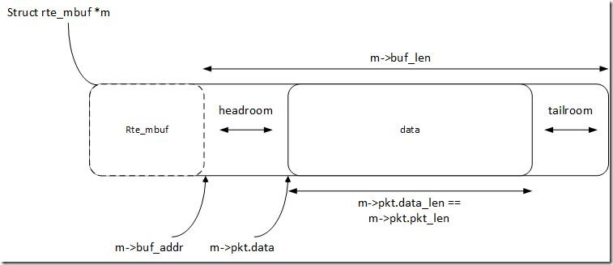

# Lab2 - Send and Receive Packets with DPDK
## Part 1: Get familiar with DPDK
### Q1: What's the purpose of using hugepage?
 在需要相同内存的情况下减少页表项，从而减少TLB miss率，提升性能。

### Q2: Take examples/helloworld as an example, describe the execution flow of DPDK programs?
 1. 调用 rte_eal_init() 初始化基础运行环境，失败报错
 2. 调用 rte_eal_remote() 进行多核运行初始化（遍历EAL指定的LCORE并加载线程）
 3. 主线程运行工作函数lcore_hello()
 4. 调用 rte_eal_mp_wait_lcore() 等待其他线程结束

### Q3: Read the codes of examples/skeleton, describe DPDK APIs related to sending and receiving packets.
在设置完成端口和队列之后,由下面两个API负责收发包,通过指定的端口和队列,以缓冲区中的数据收发指定的PKT数目。
 ```
 static inline uint16_t
rte_eth_rx_burst(uint16_t port_id, uint16_t queue_id,
		 struct rte_mbuf **rx_pkts, const uint16_t nb_pkts)  
负责收包，参数(端口号,队列号,缓冲区,收包数)，返回值(实际收包数)
```

```
static inline uint16_t
rte_eth_tx_burst(uint16_t port_id, uint16_t queue_id,
		 struct rte_mbuf **tx_pkts, uint16_t nb_pkts)
负责发包，参数(端口号,队列号,缓冲区,发包数)，返回值(实际发包数)
```

### Q4: Describe the data structure of 'rte_mbuf'.
rte_mbuf跟数据有关的域主要有：
```
struct rte_mbuf {
	void *buf_addr; /**< Virtual address of segment buffer. */
	uint16_t data_off;
	uint32_t pkt_len; /**< Total pkt len: sum of all segments. */
	uint16_t data_len; /**< Amount of data in segment buffer. */
	uint16_t buf_len
	......
}
```
rte_mbuf的结构如图所示：

分为headroom，data，tailroom三个区域，报文数据放在data段中。data_off的默认值是headroom的大小128byte。rte_pktmbuf_mtod()返回的指针指向data的起始位置。

## Part 2: send packets with DPDK
### 实现
基于skeleton骨架，在工作函数中使用rte_pktmbuf_alloc()分配rte_mbuf，使用rte_pktmbuf_mtod()获取mbuf的data段地址，填入以太网、IP、UDP协议包头，计算checksum和包长度，再写入payload。

### 运行
参照lab2说明文档装好dpdk的环境，在本目录下make。  
注意在每次运行前都要分配大页，绑定虚拟网卡，二进制可执行文件需在root状态下运行。

### 运行结果

如图，使用wireshark捕获网络适配器收到的包，可见共接收到32个包，其payload长度为12，内容为“it's Shangqy”。因此可证明程序正确性。
