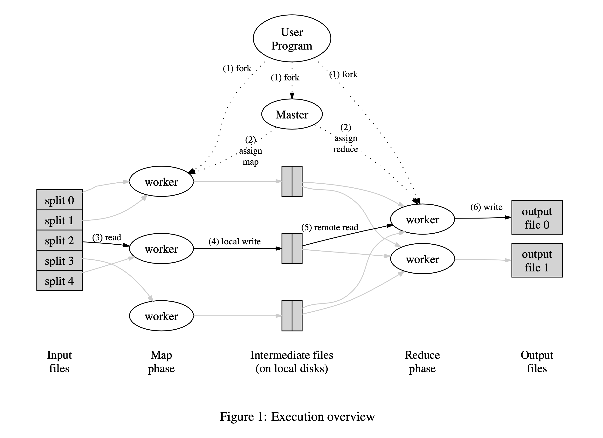
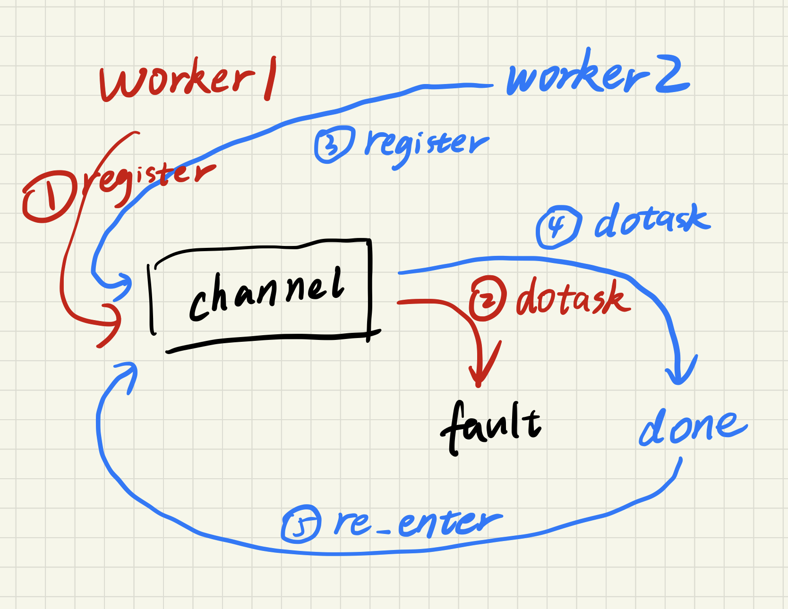
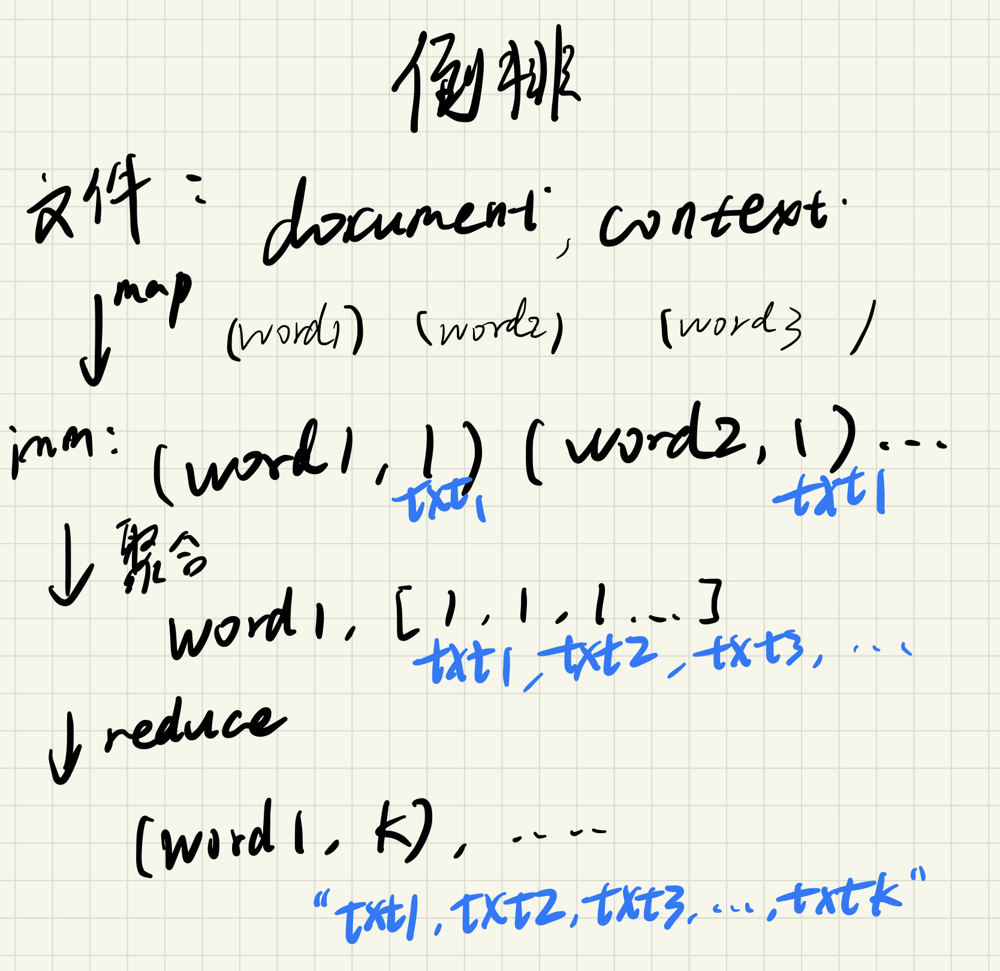

## Lab 1 -  Report

- Student ID: 518021910472
- Student Name: 尚晴宇
- Date: 2021年5月26日


本文分四个部分，将从MapReduce论文讲起，分析项目代码是如何实现简化版的MapReduce框架，最后讲述实验内容的完成过程和总结反思。


## 一、MapReduce论文理解与回顾

MapReduce是一个用于处理大规模数据的分布式计算框架。分布式计算框架往往看重灵活易使用的前端，和高性能可拓展的后端，这在图计算和深度学习领域也是如此。而对MapReduce这个处理大规模同质数据的框架来说，应该从两方面来理解：一是它为程序员提供了什么样的抽象，给上层编程人员提供了什么样的编程模型，即编程时对此系统功能和性质的认识；二是它内部是如何实现，从而为上层提供多种支持和保证。

### Section 2: Programming Model

编程模型是这篇工作最突出的贡献，它所解决的“重要的问题”在于给各种大规模计算在分布式编程时提供了便利。

> Users specify a *map* function that processes a key/value pair to generate a set of intermediate key/value pairs, and a *reduce* function that merges all intermediate values associated with the same intermediate key.
>
> ```
> map    (k1,v1)        → list(k2,v2)
> reduce (k2,list(v2))  → list(v2)
> ```
>
> the input keys and values are drawn from a different domain than the output keys and values. Furthermore, the intermediate keys and values are from the same do- main as the output keys and values.
>
> Our C++ implementation passes strings to and from the user-defined functions and leaves it to the user code to convert between strings and appropriate types.

上面选取的是论文中Section 2的内容，主要明确用户定义的Map和Reduce函数的外在表现和要求（如键值对的域）。而要真正应用MapReduce框架，还需要对MapReduce的语义有更直观的理解，可参考论文Section 2.3部分。简单来说，一个任务是否适合使用MapReduce模型来解决，需要看是否满足以下两点要求：

- 计算的数据规模大，需要利用并行与分布式计算来加速
- 计算任务之间没有依赖，没有先后顺序关系，任务完成的先后顺序对结果没有影响（操作元满足交换律）

当然，在云计算繁荣发展的今天，关于MapReduce模型的优化在学术界备受关注，最近的一篇工作提出用符号执行的方法破除顺序依赖，使MapReduce框架也能加速存在计算先后顺序的计算过程。

### Section 3: Implementation

框架实现是这篇工作的实际困难与巧妙解法，系统软件要做的就是将简单留给用户，复杂性留给自己。

> As a reaction to this complexity, we designed a new abstraction that allows us to express the simple computa- tions we were trying to perform but hides the messy de- tails of parallelization, fault-tolerance, data distribution and load balancing in a library.
>
> The run-time system takes care of the details of partitioning the input data, scheduling the program’s execution across a set of machines, handling ma- chine failures, and managing the required inter-machine communication.

#### 3.1 **Execution Overview**

分布式计算任务的完成是一个框架首先考虑的事，理解执行过程才能理解分布式编程的一般思路（对实验的完成也很有帮助），其次才是容错、性能等方面，因此这里将引用论文中关于执行过程的全部说明。执行过程如下图所示：



> 1. The MapReduce library in the user program first splits the input files into M pieces of typically 16 megabytes to 64 megabytes (MB) per piece (con- trollable by the user via an optional parameter). It then starts up many copies of the program on a clus- ter of machines.
> 2. One of the copies of the program is special – the master. The rest are workers that are assigned work by the master. There are M map tasks and R reduce tasks to assign. The master picks idle workers and assigns each one a map task or a reduce task.
> 3. A worker who is assigned a map task reads the contents of the corresponding input split. It parses key/value pairs out of the input data and passes each pair to the user-defined *Map* function. The interme- diate key/value pairs produced by the *Map* function are buffered in memory.
> 4. Periodically, **the buffered pairs are written to local disk, partitioned into R regions by the partitioning function.** The locations of these buffered pairs on the local disk are passed back to the master, who is responsible for forwarding these locations to the reduce workers.
> 5. When a reduce worker is notified by the master about these locations, it uses remote procedure calls to read the buffered data from the local disks of the map workers. When a reduce worker has read all in- termediate data, it sorts it by the intermediate keys so that all occurrences of the same key are grouped together. The sorting is needed because typically many different keys map to the same reduce task. **If the amount of intermediate data is too large to fit in memory, an external sort is used.**
> 6. The reduce worker iterates over the sorted interme- diate data and for each unique intermediate key en- countered, **it passes the key and the corresponding set of intermediate values to the user’s *Reduce* func- tion.** The output of the *Reduce* function is appended to a final output file for this reduce partition.
> 7. When all map tasks and reduce tasks have been completed, the master wakes up the user program. At this point, the MapReduce call in the user pro- gram returns back to the user code.

以上过程标号与图中标号对应，文字加粗部分是个人认为需要着重记忆的或“smart”的实现。

#### 3.x Other Problem in Distributed Systems

Section 3的其他内容将在以下做简要概括：

- **Master Data Structures：**Master是整个MapReduce过程的管理者，是Worker间通讯的线人，它将保存任务的状态，以及文件内容在文件系统中的位置等。
- **Fault Tolerance：**
  - Worker是无状态的，任意宕机的Worker上完成的任务可被其他Worker重做。
  - Master只有一个，宕机的可能性很小，因此若Master宕机则MapReduce任务失败，交给应用来处理。
  - 并行与分布式计算的正确性需要通过和可能的顺序执行结果进行比较来衡量。本来每个Worker操作的数据对象是不重叠的，因此不会有并发错误，但Worker宕机导致的任务重做可能会使系统各部分看到的状态不同，这时 ```We rely on atomic commits of map and reduce task outputs to achieve this property.``` 包括两点：1. Map任务的完成由唯一的Master来仲裁；2. 底层的分布式文件系统提供rename的原子性来保证reduce输出唯一。
- **Locality：**任务调度要考虑局部性，避免数据的网络传输。实际上这点在大型分布式系统中非常重要！
- **Task Granularity**：理论上任务粒度越细越好， ```Having each worker perform many different tasks improves dynamic load balancing, and also speeds up recovery when a worker fails: the many map tasks it has completed can be spread out across all the other worker machines.``` 但现实能够支持的调度数量是有限的，请记住以下数字：```We often per- form MapReduce computations with M = 200, 000 and R = 5, 000, using 2,000 worker machines.```
- **Backup Tasks：**木桶效应，分布式问题就像是管理问题，是调度问题。不同的机器能力不同，快的得等慢的，当然管机器比管人要容易的多。这里举李沐（交大学长，亚马逊CTO，分布式深度学习框架）的[五年工作感悟](https://zhuanlan.zhihu.com/p/374777591?utm_source=qq&utm_medium=social&utm_oi=989596755247349760)。 ```When a MapReduce operation is close to completion, the master schedules backup executions of the remaining *in-progress* tasks.```

以上就是MapReduce论文1到3节的全部内容理解，对于今后把握项目整体思想、分析分布式编程主要问题都有所帮助。


## 二、MapReduce代码框架分析

实验代码MapReduce是由MIT设计实现的用于教学的简化版本，通过此版本可以更好的理解上述编程模型和底层执行过程。我们的关注点在于`wc.go`中的由我们定义的map和reduce函数，以及`mapreduce`包中的所有内容。

```go
func main() {
	if len(os.Args) < 4 {
		fmt.Printf("%s: see usage comments in file\n", os.Args[0])
	} else if os.Args[1] == "master" {
		var mr *mapreduce.Master
		if os.Args[2] == "sequential" {
			mr = mapreduce.Sequential("wcseq", os.Args[3:], 3, mapF, reduceF)
		} else {
			mr = mapreduce.Distributed("wcseq", os.Args[3:], 3, os.Args[2])
		}
		mr.Wait()
	} else {
		mapreduce.RunWorker(os.Args[2], os.Args[3], mapF, reduceF, 100, nil)
	}
}
```

上面展示了`wc.go`中的`main`函数的内容。与论文附录中展示的代码类似，用户通过指定自定义的map和reduce函数，构造特殊的数据结构（实验中是传多个参数）作为`MapReduce`函数的调用参数来开始一项MapReduce任务。在实验代码实现的MapReduce框架中，`mapreduce.Sequential` 和 `mapreduce.Distributed` 是 *MapReduce* 对外提供的两个接口。由于正确实现的MapReduce框架可以与顺序执行产生同样的结果，实验代码设计了顺序执行的`mapreduce.Sequential`来方便我们调试，以及在编写用户map和reduce函数时加深对程序行为的认识。

### 1. 首先我们沿着函数调用路径来分析代码逻辑和部件间的协作：

由于真实的分布式计算框架只需提供 `mapreduce.Distributed` 即可，我们首先分析用户主函数通过 `mapreduce.Distributed` 的调用能否完成分布式计算任务。

 `mapreduce.Distributed` 调用层次图如下：`run`中的`schedule`是由`distribute`传入的。

```
main
｜—— Distributed
    ｜—— newMaster
    ｜—— mr.startRPCServer
    ｜—— go mr.run
        ｜—— schedule(mapPhase)
            ｜—— go mr.forwardRegistrations(ch)
            ｜—— schedule(mr.jobName, mr.files, mr.nReduce, mapPhase, ch)
        	｜—— go call(reg, "Worker.DoTask", ...)
        ｜—— schedule(reducePhase)
            ｜—— go mr.forwardRegistrations(ch)
            ｜—— schedule(mr.jobName, mr.files, mr.nReduce, reducePhase, ch)
        	｜—— go call(reg, "Worker.DoTask", ...)
        ｜—— mr.merge()
        ｜—— mr.doneChannel <- true
        ｜—— mr.killWorkers
        ｜—— mr.stopRPCServer
｜—— mr.Wait()
```

分析调用路径后，奇怪的是，整个调用过程没有Worker的参与，即使Master声明了RPC，也没有Worker注册。**也就是说，用户不能仅通过 `mapreduce.Distributed` 的调用完成分布式并行计算任务，而需要`mapreduce.RunWorker`的配合，这与论文附录中的接口区别较大**。

那我们自定义的map和reduce函数在测试时并没有并行计算吗？是的。


```shell
#!/bin/bash
go run wc.go master sequential pg-*.txt
sort -n -k2 mrtmp.wcseq | tail -10 | diff - mr-testout.txt > diff.out
if [ -s diff.out ]
then
echo "Failed test. Output should be as in mr-testout.txt. Your output differs as follows (from diff.out):" > /dev/stderr
  cat diff.out
else
  echo "Passed test" > /dev/stderr
fi
```

上面展示了`test_wc.sh`中的内容，另外查看` test_ii.sh`以及`test_mr.sh`两个测试文件后，可以看出我们自己编写的两套map和reduce函数只运行在`sequential`模式下，这是很令人失望的。考察`RunWorker`函数的被调用情况，只有`test_test.go`中调用过，当然了，测试的执行和main的执行也没有本质的区别啦。。

### 2. 更重要的，从面向对象的角度分析如何从零构建MapReduce框架

思考论文中Section 3的执行过程概述以及Master数据结构部分，我们要怎样在单机多核上实现并行计算呢？那我们可以用多线程模拟Master和Worker。

- Master管理MapReduce任务，记录整个任务的元数据（任务名、Map个数、Reduce个数等），实现数据集划分和任务调度的策略，负责与Worker通信进行任务分发（需要Master和Worker间制定协议），对Reduce的结果进行合并。

- Worker负责map和reduce的执行，将用户定义的map和reduce函数应用在数据集上得到结果（结果在文件系统上共享需要协议）。

上面是论文中的要求，作为简化，实验代码中Master并未实现数据集的划分，而是需要用户划分后通过文件指定Map的数量（其实在论文附录的代码中也是这样做的）。

用go语言实现是相对简单的，任务分发用RPC库，状态监视用goroutine加通道、信号量。mapreduce包中的每个文件都分工明确，整体上实验代码非常清晰、整洁。


## 三、实验问题的解决思路和代码实现

#### 实验整体解决思路

实验问题整体上并不复杂，解决思路实际上只要阅读代码，找到该函数被调用的语境，结合论文和实验文档理解函数需要完成的任务，对整个包内容即自己可以使用的现有资源有充分的认识，以及阅读注释和文档掌握编程细节和go语言库函数即可。不同部分的具体要求不同，思考的领域维度也不相同，但只要根据实验步骤，循序渐进，就会发现实验就像一个个puzzle一样，以阅读、理解、填空为主，既不会让人灰心丧气，还享受到克服困难、学习新语言的成就感。

实现过程中，我并没有碰到太多Bug，让人印象深刻的是Part I的 `doReduce` 函数，以及Part III的 `schedule` 函数的Bug。

### Part I: Map/Reduce input and output

这一部分要求实现的是 `commen_map.go` 中的 `doMap` 函数和`commen_reduce.go` 中的 `doReduce` 函数。

`doMap` 函数：该函数的功能是完成单个给定的mapTask。其主要执行过程如下：

- 创建中间键值文件，创建相应的`json.Encoder`
- 读入map任务的输入文件内容，用`ioutil.ReadFile()`，然后调用map函数得到中间键值对
- 对键算哈希，确定键值对要写入的文件，然后以json格式写入

```go
func doMap(
   jobName string, // the name of the MapReduce job
   mapTask int, // which map task this is
   inFile string,
   nReduce int, // the number of reduce task that will be run ("R" in the paper)
   mapF func(filename string, contents string) []KeyValue,
) {
   
   interFiles := make([]*os.File, nReduce)
   encoders := make([]*json.Encoder, nReduce)
   for i := 0; i < nReduce; i++ {
      interFile, err := os.Create(reduceName(jobName, mapTask, i))
      if err != nil {
         log.Fatal("check: ", err)
      }
      interFiles[i] = interFile
      encoders[i] = json.NewEncoder(interFile)
   }

   inputFile, err := ioutil.ReadFile(inFile)
   if err != nil {
      log.Fatal("check: ", err)
   }
   inputKeyValue := mapF(inFile, string(inputFile[:]))

   for _, _KeyValue := range inputKeyValue {
      index := ihash(_KeyValue.Key) % nReduce
      err = encoders[index].Encode(&_KeyValue)
      if err != nil {
         log.Fatal("check: ", err)
      }
   }

   for i := 0; i < nReduce; i++ {
      err = interFiles[i].Close()
      if err != nil {
         log.Fatal("check: ", err)
      }
   }
}
```

`doReduce` 函数：该函数用来完成单个给定的reduceTask。其执行过程如下：

- 收集由它负责的键值对，读出文件中用json编码的键值对：如注释中所述对一个文件不断decode直到报错为止
- 按键排序，即把相同键的键值对聚集到一起
- 创建输出文件，创建对应的`json.Encoder`
- 通过键的变化把相同键的所有值形成字符串数组，调用reduce函数得到结果，写入文件中

```go
func doReduce(
   jobName string, // the name of the whole MapReduce job
   reduceTask int, // which reduce task this is
   outFile string, // write the output here
   nMap int, // the number of map tasks that were run ("M" in the paper)
   reduceF func(key string, values []string) string,
) {

   var KeyValues []KeyValue
   for i := 0; i < nMap; i++ {
      interFile, err := os.Open(reduceName(jobName, i, reduceTask))
      if err != nil {
         log.Fatal("check: ", err)
      }
      decoder := json.NewDecoder(interFile)
      for {
         var kv KeyValue
         err = decoder.Decode(&kv)
         if err != nil {
            break
         }
         KeyValues = append(KeyValues, kv)
      }
      err = interFile.Close()
      if err != nil {
         log.Fatal("check: ", err)
      }
   }

   sort.Slice(KeyValues, func(i, j int) bool {return KeyValues[i].Key < KeyValues[j].Key})

   outputFile, err := os.Create(outFile)
   if err != nil {
      log.Fatal("check: ", err)
   }
   encoder := json.NewEncoder(outputFile)

   var values []string
   var key string
   if len(KeyValues) > 0 {
      key = KeyValues[0].Key
      for _, kv := range KeyValues {
         if kv.Key == key {
            values = append(values, kv.Value)
         } else {
            err = encoder.Encode(KeyValue{key, reduceF(key, values)})
            if err != nil {
               log.Fatal("check: ", err)
            }
            values = make([]string, 0)
            values = append(values, kv.Value)
            key = kv.Key
         }
      }

      err = encoder.Encode(KeyValue{key, reduceF(key, values)})
      if err != nil {
         log.Fatal("check: ", err)
      }
   }

   err = outputFile.Close()
   if err != nil {
      log.Fatal("check: ", err)
   }
}
```


### Part II: Single-worker word count

这部分要仿照论文中示例给出自定义函数，也就是map处理输入的字符串对其中的每个单词输出中间键值对，因为中间键值对的值都是1所以reduce直接算中间值数组长度即可。

本以为字符串处理和判断单词是个难事，点开文档链接一看就会了，甚至字符串转换都贴心的写好了参考。

```go
func mapF(filename string, contents string) []mapreduce.KeyValue {
   // Your code here (Part II).
   f := func(c rune) bool {
      return !unicode.IsLetter(c)
   }

   words := strings.FieldsFunc(contents, f)
   var KeyValues []mapreduce.KeyValue
   for _, word := range words {
      KeyValues = append(KeyValues, mapreduce.KeyValue{word, "1"})
   }
   return KeyValues
}

func reduceF(key string, values []string) string {
   // Your code here (Part II).
   return strconv.Itoa(len(values))
}
```


### Part III: Distributing MapReduce tasks

这部分是要上手并行计算了。也是实验中最有趣的部分，涉及go语言通道和信号量的使用。

- 已知我们就是要调RPC，RPC不能阻塞因此要用go routine开协程来监视调用情况。
- RPC中参数构建较简单，弄清楚通道里的Worker address是怎么来的就会用了。已知Worker `DoTask` 结束后不会再次注册，因此RPC返回后要将该Worker重新放入通道。
- 使用`sync.WaitGroup` 来同步所有RPC的结束。

这里遇到了一个很关键的bug: `wg.done()` 和 `registerChan <- worker` 这两句写反了。这就出现了输出中显示map task都做完了但就是无法输出`Schedule: mapPhase done` 这句话。说明主线程被阻塞住了，为什么呢？因为这个`registerChan` 通道是没有缓冲区的，也就是通道中最多只有一个值，再往进放就会阻塞住。于是产生了如下循环依赖：

- 主线程在等所有协程`wg.done()` 
- 完成任务的协程在等主线程开新的协程消费通道中的内容，才好把信号放进通道中

***我个人认为在创建通道时给通道声明task数量的缓冲区会更好，因为这样协程才会顺利退出，否则飘着的协程虽不影响主线程接下来的执行，但浪费内存空间，而且调度时会浪费CPU时间。***

修改顺序后，打破循环依赖，就顺利通过测试了～

```go
func schedule(jobName string, mapFiles []string, nReduce int, phase jobPhase, registerChan chan string) {
   var ntasks int
   var n_other int // number of inputs (for reduce) or outputs (for map)
   switch phase {
   case mapPhase:
      ntasks = len(mapFiles)
      n_other = nReduce
   case reducePhase:
      ntasks = nReduce
      n_other = len(mapFiles)
   }

   fmt.Printf("Schedule: %v %v tasks (%d I/Os)\n", ntasks, phase, n_other)

   // All ntasks tasks have to be scheduled on workers. Once all tasks
   // have completed successfully, schedule() should return.
   //
   // Your code here (Part III, Part IV).
   //
   var wg sync.WaitGroup
   wg.Add(ntasks)
   for i := 0; i < ntasks; i++ {
      taskNumber := i
      go func() {
         var worker string
         for {
            reg := <-registerChan
            result := call(reg, "Worker.DoTask", DoTaskArgs{
               JobName:       jobName,
               File:          mapFiles[taskNumber],
               Phase:         phase,
               TaskNumber:    taskNumber,
               NumOtherPhase: n_other,
            }, nil)
            if result == true {
               worker = reg
               break
            }
         }
         wg.Done()
         registerChan <- worker
      }()
   }
   wg.Wait()
   fmt.Printf("Schedule: %v done\n", phase)
}
```


### Part IV: Handling worker failures

此部分只需在上一部分的基础上加上循环，即在RPC失败时选取下一空闲的Worker重做任务，在RPC返回成功时退出即可。



没想到只加了几行就通过测试了，但它确实是这样。


### Part V: Inverted index generation (OPTIONAL)

这部分要完成倒排索引的建立，其实就是加深对map和reduce函数语义的认识，用它们做更多有意义的事。



如上图所示，黑色是词数统计的过程，蓝色是倒排索引的区别。将生成倒排索引的任务与此前的词数统计做对比，很容易知道该如何改进。

这里关键问题是去除重复，这里选择在reduce阶段做，这样编程更简洁明了，同时很容易证明是正确的。去除重复采用和Part I `doReduce` 中类似的方法，将所有中间value排序，然后统计不同的内容。

```go
func mapF(document string, value string) (res []mapreduce.KeyValue) {
   // Your code here (Part V).
   f := func(c rune) bool {
      return !unicode.IsLetter(c)
   }

   words := strings.FieldsFunc(value, f)
   var KeyValues []mapreduce.KeyValue
   for _, word := range words {
      KeyValues = append(KeyValues, mapreduce.KeyValue{word, document})
   }
   return KeyValues
}

func reduceF(key string, values []string) string {
   // Your code here (Part V).
   var reduceValue []string
   var lastValue string
   sort.Slice(values, func(i, j int) bool {return values[i] < values[j]})
   if len(values) > 0 {
      reduceValue = append(reduceValue, values[0])
      lastValue = values[0]
      for _, value := range values {
         if value != lastValue {
            reduceValue = append(reduceValue, value)
            lastValue = value
         }
      }
   }
   return strconv.Itoa(len(reduceValue)) + " " + strings.Join(reduceValue, ",")
}
```


## 四、实验过程总结与反思

从科研项目的角度看，我越来越理解高校搞科研面对的问题：资源的限制。

- 由MIT设计的这个实验，是运行在单机上的简化版本，作为我们这次云计算课程实验，它与我曾做过的其他众多实验体量类似，也没有实际应用的能力，如果不是作为名校开源的教材，可能没几个人会注意到这份框架实现。

- 这篇分布式场景下的经典工作，出自谷歌。假设MIT先想到搞这样的研究，不与企业合作的话，倒也可以写一个版本，但evaluation没法在真实场景下测只能模拟、调研工作也会比企业的人付出更多更多，最后发论文后也很难有实际项目落地。相比之下，企业做这样的研究就容易很多：Google发论文无数、微软研究院与英特尔是好兄弟，动不动就改硬件发论文、阿里达摩院宣讲时论文的产出等等。
- 所以，**要与企业良性合作，互利互惠**，做适应工业界当下需求的科研，积极与工业界交流。


从课程实验的角度看，该实验如果在以下方面作出改进会更好：

1. 简化注释，可将注释内容转移到文档中，以不经意的形式。这次实验注释过于详尽，使同学对很多数据结构的设计都缺乏思考。
2. 增加问题练习，在文档中增加需要在实验报告中回答的问题，加深同学对重点的理解。不仅能看懂，而且会表达。
3. 补充测试，这次实验测试过于简单，显然遗漏了某些边界情况，而且Part V自定义函数运行在Sequential模式下（过度简化）。随随便便就过了测试不能让同学们养成编程时缜密的思考方式。
4. 论文中有`If the amount of intermediate data is too large to fit in memory, an external sort is used.` 这样的描述，迭代器在数据量大时很常用，但如何构造和实现迭代器依然很陌生，如果简化框架能加入迭代器的实现就更好了。

